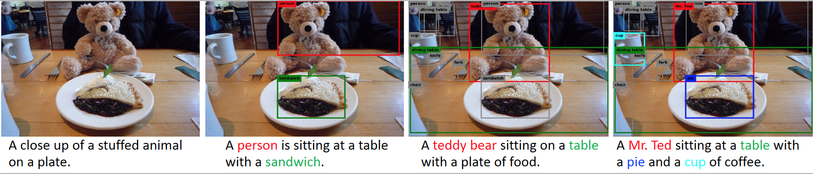
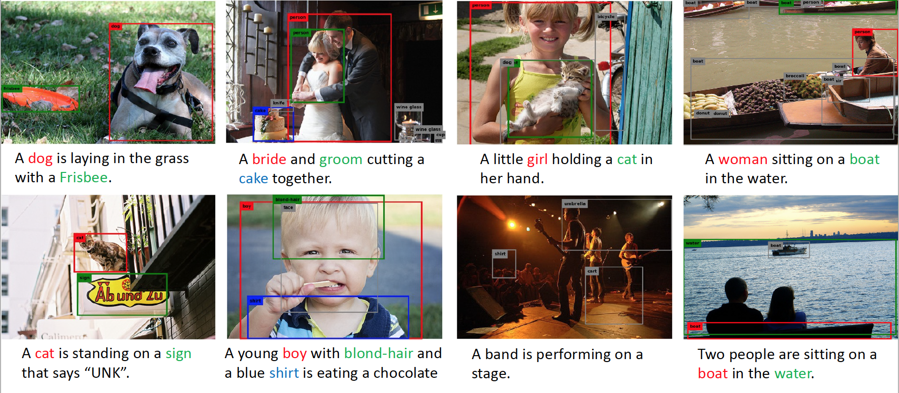

# Neural Baby Talk




## Docker Setup

This repository provides a Dockerfile for setting up all dependencies and preprocessed data for COCO experiments (normal / robust / NOC). Docker support for Flickr30k experiments is not yet supported. To build the Dockerfile, just execute this from project root:

```shell
docker build -t nbt .
```

Before running the container, you need to get COCO dataset downloaded and kept somewhere in your filesystem. Declare two environment variables:
1. `$COCO_IMAGES`: path to a directory with sub-directories of images as `train2014`, `val2014`, `test2015`, etc...
2. `$COCO_ANNOTATIONS`: path to a directory with annotation files like `instances_train2014.json`, `captions_train2014.json` etc...

These directories will be attached as "volumes" to our docker container for Neural Baby Talk to use within. Run the docker image within a container in an interactive mode (bash session). Get [nvidia-docker](https://www.github.com/NVIDIA/nvidia-docker) and execute this command to run the fresh built docker image.

```shell
nvidia-docker run --name nbt_container -it \
     -v $COCO_IMAGES:/workspace/neuralbabytalk/data/coco/images \
     -v $COCO_ANNOTATIONS:/workspace/neuralbabytalk/data/coco/annotations \
     --shm-size 8G nbt /bin/bash
```

Ideally, shared memory size (`--shm-size`) of 8GB would be enough. Tune it according to your requirements / machine specifications.

**Saved Checkpoints:** All checkpoints will be saved in `/workspace/neuralbabytalk/save`. From outside the container, execute this to get your checkpoints from this container into the main filesystem:

```shell
docker container cp nbt_container:workspace/neuralbabytalk/save /path/to/local/filesystem/save
```

Skip directly to **Training and Evaluation** section to execute specified commands within the container.


## requirement

Inference:

- [pytorch](http://pytorch.org/)
- [torchvision](https://github.com/pytorch/vision)
- [torchtext](https://github.com/pytorch/text)

Data Preparation:

- [stanford-corenlp-wrapper](https://github.com/Lynten/stanford-corenlp)
- [stanford-corenlp](https://stanfordnlp.github.io/CoreNLP/)

Evaluation:

- [coco-caption](https://github.com/jiasenlu/coco-caption): Download the modified version of coco-caption and put it under `tools/`


## Demo

#### Without detection bbox


#### With detection bbox

#### Constraint beam search
This code also involve the implementation of constraint beam search proposed by Peter Anderson. I'm not sure my impmentation is 100% correct, but it works well in conjuction with neural baby talk code. You can refer to [this](http://users.cecs.anu.edu.au/~sgould/papers/emnlp17-constrained-beam-search.pdf) paper for more details. To enable CBS while decoding, please set the following flags:
```
--cbs True|False : Whether use the constraint beam search.
--cbs_tag_size 3 : How many detection bboxes do we want to include in the decoded caption.
--cbs_mode all|unqiue|novel : Do we allow the repetive bounding box? `novel` is an option only for novel object detection task.
```

## Training and Evaluation
### Data Preparation
Head to `data/README.md`, and prepare the data for training and evaluation.

### Pretrained model
| Task | Dataset | Backend | Batch size | Link  |
| ---- | :----:| :----:| :----:|:----:|
| Standard image captioning | COCO | Res-101 | 100 | [Pre-trained Model](https://www.dropbox.com/s/6buajkxm9oed1jp/coco_nbt_1024.tar.gz?dl=0) |
| Standard image captioning | Flickr30k | Res-101 | 50 | [Pre-trained Model](https://www.dropbox.com/s/cirzj1b2jul6yzx/flickr30k_nbt_1024.tar.gz?dl=0) |
| Robust image captioning | COCO | Res-101 | 100 | [Pre-trained Model](https://www.dropbox.com/s/sxuodvob0ftesm9/robust_coco_nbt_1024.tar.gz?dl=0) |
| Novel object captioning | COCO | Res-101 | 100 | [Pre-trained Model](https://www.dropbox.com/s/b7i6vx5pf98540l/noc_coco_nbt_1024.tar.gz?dl=0) |


### Standard Image Captioning
##### Training (COCO)

First, modify the cofig file `cfgs/normal_coco_res101.yml` with the correct file path.

```
python main.py --path_opt cfgs/normal_coco_res101.yml --batch_size 20 --cuda True --num_workers 20 --max_epoch 30
```
##### Evaluation (COCO)
Download Pre-trained model. Extract the tar.zip file and put it under `save/`.

```
python main.py --path_opt cfgs/normal_coco_res101.yml --batch_size 20 --cuda True --num_workers 20 --max_epoch 30 --inference_only True --beam_size 3 --start_from save/coco_nbt_1024
```

##### Training (Flickr30k)
Modify the cofig file `cfgs/normal_flickr_res101.yml` with the correct file path.

```
python main.py --path_opt cfgs/normal_flickr_res101.yml --batch_size 20 --cuda True --num_workers 20 --max_epoch 30
```

##### Evaluation (Flickr30k)
Download Pre-trained model. Extract the tar.zip file and put it under `save/`.

```
python main.py --path_opt cfgs/normal_flickr_res101.yml --batch_size 20 --cuda True --num_workers 20 --max_epoch 30 --inference_only True --beam_size 3 --start_from save/flickr30k_nbt_1024
```

### Robust Image Captioning

##### Training
Modify the cofig file `cfgs/normal_flickr_res101.yml` with the correct file path.

```
python main.py --path_opt cfgs/robust_coco.yml --batch_size 20 --cuda True --num_workers 20 --max_epoch 30
```
##### Evaluation (robust-coco)
Download Pre-trained model. Extract the tar.zip file and put it under `save/`.

```
python main.py --path_opt cfgs/robust_coco.yml --batch_size 20 --cuda True --num_workers 20 --max_epoch 30 --inference_only True --beam_size 3 --start_from save/robust_coco_nbt_1024
```

### Novel Object Captioning

##### Training
Modify the cofig file `cfgs/noc_coco_res101.yml` with the correct file path.

```
python main.py --path_opt cfgs/noc_coco_res101.yml --batch_size 20 --cuda True --num_workers 20 --max_epoch 30
```
##### Evaluation (noc-coco)
Download Pre-trained model. Extract the tar.zip file and put it under `save/`.

```
python main.py --path_opt cfgs/noc_coco_res101.yml --batch_size 20 --cuda True --num_workers 20 --max_epoch 30 --inference_only True --beam_size 3 --start_from save/noc_coco_nbt_1024
```

### Multi-GPU Training
This codebase also support training with multiple GPU. To enable this feature, simply add `--mGPUs Ture` in the commnad.

### Self-Critic Training and Fine-Tuning CNN

This codebase also support self-critic training and fine-tuning CNN. You are welcome to try this part and upload your trained model to the repo!

## More Visualization Results


## Reference
If you use this code as part of any published research, please acknowledge the following paper

```
@inproceedings{Lu2018Neural,
author = {Lu, Jiasen and Yang, Jianwei and Batra, Dhruv and Parikh, Devi},
title = {Neural Baby Talk},
booktitle = {CVPR},
year = {2018}
}
```
## Acknowledgement
We thank Ruotian Luo for his [self-critical.pytorch](https://github.com/ruotianluo/self-critical.pytorch) repo. 
